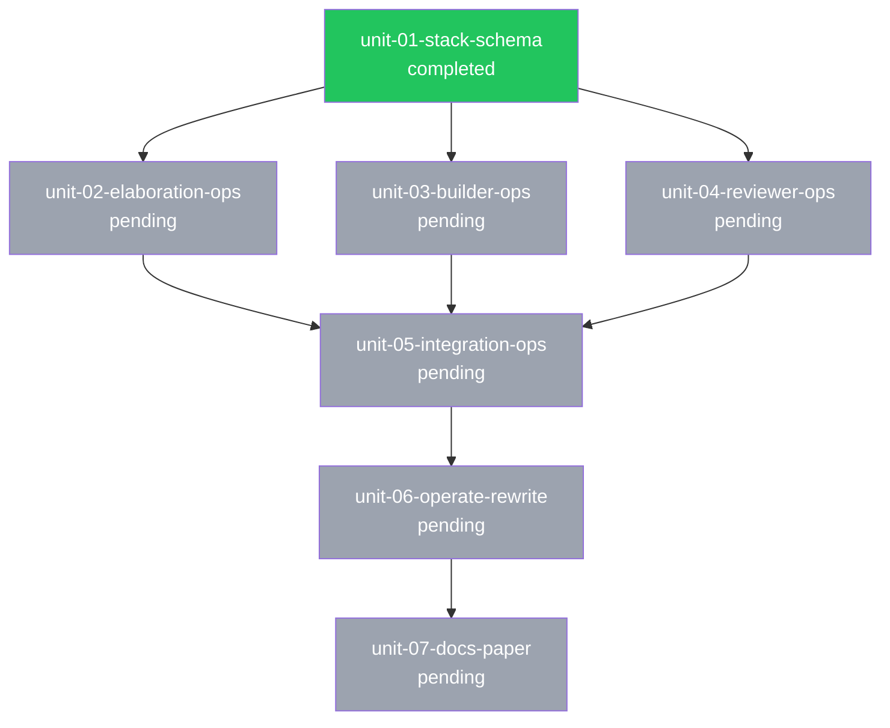

# Discovery Log: Visual Review & Intent Dashboard

Elaboration findings persisted during Phase 2.5 domain discovery.
Builders: read section headers for an overview, then dive into specific sections as needed.

## Technology Choice: MCP Channel Server Runtime

**Decision:** Use Bun as the runtime for the MCP channel server, matching the official channel plugins (fakechat, telegram, discord, imessage). The MCP SDK (`@modelcontextprotocol/sdk` v1.28.0) works with Bun, Node, and Deno — but Bun provides built-in HTTP server (`Bun.serve()`), WebSocket support, and TypeScript execution without a build step.

**Low-level Server class required:** The channel protocol requires `server.notification()` and `server.setNotificationHandler()` which only exist on the low-level `Server` class (from `@modelcontextprotocol/sdk/server/index.js`), NOT the high-level `McpServer` class.

**Key dependencies:**
- `@modelcontextprotocol/sdk` — MCP protocol, Server class, StdioServerTransport
- `zod` — Peer dependency of MCP SDK, used for notification schema validation
- `gray-matter` — YAML frontmatter parsing from markdown files
- `marked` or template literals — Markdown-to-HTML conversion for review pages

## Codebase Pattern: Claude Code Channel Protocol

The channel protocol (research preview, CC v2.1.80+) works as follows:

**Server declaration:**
```ts
const mcp = new Server(
  { name: "ai-dlc-review", version: "0.1.0" },
  {
    capabilities: {
      experimental: { "claude/channel": {} },
      tools: {},
    },
    instructions: "Review decisions arrive as <channel source=\"ai-dlc-review\" ...>...",
  },
);
```

**Inbound flow (browser → Claude Code):**
1. User makes decision in browser UI
2. Browser POSTs to local HTTP server
3. Server calls `mcp.notification({ method: "notifications/claude/channel", params: { content, meta } })`
4. Event arrives in Claude's context as `<channel source="ai-dlc-review" decision="approved" ...>content</channel>`

**Outbound flow (Claude → browser):**
1. Claude calls MCP tool (e.g., `open_review`) with intent/unit data
2. Tool handler renders review page, opens browser
3. Tool returns confirmation to Claude

**Testing:** Use `--dangerously-load-development-channels server:ai-dlc-review` during development.

**Packaging:** Plugin wrapper for `--channels plugin:ai-dlc-review@ai-dlc` distribution.

## Reference Implementation: Fakechat Channel Plugin

The official `fakechat` plugin is the closest analog to our review UI. Key patterns extracted:

**Architecture:** Single `server.ts` file (~280 lines including embedded HTML). Bun runtime. HTTP on localhost:8787 (configurable via env var). WebSocket for real-time message broadcast. HTML UI embedded as a template literal in the server file.

**HTTP routes:**
- `GET /` — Serves the embedded HTML UI
- `GET /ws` — WebSocket upgrade for real-time updates
- `POST /upload` — File upload handling
- `GET /files/*` — Static file serving

**Tools exposed:** `reply` (text + optional files), `edit_message` (update in-place)

**Key differences for our review UI:**
- Fakechat is a generic chat bridge. Ours is purpose-built for spec review.
- Fakechat uses monospace `<pre>` for message rendering. We need rich HTML rendering of intent/unit specs with sections, criteria checklists, DAGs, and wireframe embeds.
- Fakechat's browser window stays open for ongoing conversation. Ours opens at review boundaries and closes after decision.
- We need additional tools: `open_review` (render + open browser), `get_review_status` (check if decision made)

## Codebase Pattern: AI-DLC File Formats

### Intent File (`intent.md`)

**Frontmatter fields:**
| Field | Type | Values | Purpose |
|-------|------|--------|---------|
| `workflow` | string | default, adversarial, design, hypothesis, tdd | Hat sequence |
| `git.change_strategy` | string | unit, intent, trunk | Branch strategy |
| `git.auto_merge` | boolean | true/false | Auto-merge units |
| `git.auto_squash` | boolean | true/false | Squash commits |
| `announcements` | array | changelog, release-notes, social-posts, blog-draft | Completion artifacts |
| `passes` | array | design, product, dev | Multi-pass iteration |
| `active_pass` | string | | Current pass |
| `iterates_on` | string | | Previous intent slug |
| `created` | string | ISO date | Creation date |
| `status` | string | active, completed, blocked, closed | Lifecycle state |
| `epic` | string | | Ticketing epic key |

**Body sections:** Problem, Solution, Domain Model (Entities, Relationships, Data Sources, Data Gaps), Success Criteria (checkboxes), Context

### Unit File (`unit-NN-slug.md`)

**Frontmatter fields:**
| Field | Type | Values | Purpose |
|-------|------|--------|---------|
| `status` | string | pending, in_progress, completed, blocked | Work state |
| `last_updated` | string | ISO 8601 UTC | Last status change |
| `depends_on` | array | unit slugs | DAG edges |
| `branch` | string | | Git branch |
| `discipline` | string | backend, frontend, api, design, docs, devops, infra, observability | Work type |
| `pass` | string | | Multi-pass assignment |
| `workflow` | string | | Override workflow |
| `ticket` | string | | Ticketing key |
| `wireframe` | string | | Path to HTML wireframe |
| `design_ref` | string | | Design reference path |
| `deployment` | object | type, providers | Deployment config |
| `monitoring` | object | required, metrics, dashboards | Monitoring config |
| `operations` | object | scheduled, triggers | Ops config |

**Body sections:** Description, Discipline, Domain Entities, Data Sources, Technical Specification, Success Criteria, Risks, Boundaries, Notes

### Discovery File (`discovery.md`)

**Frontmatter:** intent (slug), created (date), status (active/archived)
**Body:** Sectioned research log with standardized headers (Codebase Pattern, External Research, Architecture Decision, Domain Model, UI Mockup, etc.)

### Wireframe Files (`mockups/unit-NN-slug-wireframe.html`)

Self-contained HTML5. Gray/white palette. No external JS or fonts. CSS classes: `.screen`, `.field`, `.btn-primary`, `.placeholder`, `.flow`, `.note`.

### State Files (`.ai-dlc/{slug}/state/`)

**iteration.json:** iteration (int), hat (string), workflow (array), workflowName (string), status (string), currentUnit (string), phase (string), maxIterations (int), needsAdvance (boolean)

## Codebase Pattern: DAG Computation

Dependencies are declared in unit frontmatter `depends_on` arrays. The DAG is computed by:
1. Scanning all `unit-*.md` files in the intent directory
2. Parsing `depends_on` and `status` from each unit's frontmatter
3. Building adjacency lists for topological ordering
4. Determining which units are ready (all deps completed), blocked (any dep not completed), or in-progress

For the review UI, the DAG needs to be rendered as a visual graph. **Mermaid.js** (client-side) is the best approach — generate a Mermaid `graph TD` definition from the unit data and let the browser render it as SVG.

Example Mermaid definition for a real intent:


## Codebase Pattern: Website Component Patterns

The existing ai-dlc.dev website (Next.js 15, Tailwind 4) has relevant patterns:

**Workflow Visualizer:** Step-based progression with playback controls, Framer Motion animations, responsive desktop/mobile layouts. Shows hat nodes with active/completed states.

**Big Picture Diagram:** SVG-based interactive nodes with selection, hover, keyboard navigation. Dark mode aware colors per category.

**Mermaid Component:** Client-side Mermaid rendering with dark mode HSL color adaptation. Already proven in the website.

**Markdown Rendering:** react-markdown + remark-gfm + rehype-highlight + rehype-slug + rehype-raw. Custom components for headings (with badges), code blocks (with copy button), tables (with overflow scroll).

**Design tokens:** Tailwind default palette, system font stack, gray-50 to gray-950 for neutrals, blue-500/600 for primary, green for success, red for danger, amber for warning, purple for secondary.

**Key insight:** The review UI and static dashboard should NOT use React/Next.js (too heavy for a local MCP channel server). Instead, use plain HTML + Tailwind CSS (via CDN) + Mermaid.js (via CDN) + vanilla JS. This matches the self-contained wireframe pattern and the fakechat embedded-HTML approach.

## External Research: Static Site Generation Approach

For the CLI dashboard generator, a lightweight TypeScript approach:

1. **Read** `.ai-dlc/` directory structure with `fs` / `Bun.file()`
2. **Parse** frontmatter with `gray-matter`
3. **Convert** markdown body sections to HTML with `marked`
4. **Compute** DAG from `depends_on` fields
5. **Generate** Mermaid graph definitions from DAG
6. **Apply** HTML templates (template literals, no engine needed)
7. **Write** static HTML files to output directory
8. **Include** Tailwind CSS via CDN + Mermaid.js via CDN in templates

Output structure:
```
out/
├── index.html              # Intent list / dashboard
├── intents/
│   ├── {slug}/
│   │   ├── index.html      # Intent detail + DAG
│   │   ├── units/
│   │   │   ├── {unit}.html # Unit detail
│   │   │   └── ...
│   │   └── mockups/        # Copied wireframe HTML files
│   │       └── ...
│   └── ...
└── assets/
    └── styles.css           # Shared styles (or inline)
```

## UI Mockup: Review Page — Intent Overview

**Source:** collaborative (no design provider)

### Layout
```
┌──────────────────────────────────────────────────────────────────────────┐
│ 🔍 AI-DLC Review                                          [Dark Mode]  │
├──────────────────────────────────────────────────────────────────────────┤
│                                                                          │
│  Intent: Full AI-DLC Operations Phase                                    │
│  ┌────────────┐ ┌───────────┐ ┌──────────────┐ ┌────────────────────┐   │
│  │ Status:    │ │ Workflow: │ │ Strategy:    │ │ Created:           │   │
│  │ ● active   │ │ default   │ │ intent       │ │ 2026-03-27         │   │
│  └────────────┘ └───────────┘ └──────────────┘ └────────────────────┘   │
│                                                                          │
│  ┌─── Tabs ────────────────────────────────────────────────────────┐    │
│  │ [Overview]  [Units & DAG]  [Domain Model]  [Technical Details]  │    │
│  └─────────────────────────────────────────────────────────────────┘    │
│                                                                          │
│  ## Problem                                                              │
│  ┌──────────────────────────────────────────────────────────────────┐   │
│  │ The AI-DLC 2026 paper defines a 9-step workflow but the plugin  │   │
│  │ only implements steps 1-4. Steps 5-9 are entirely missing...    │   │
│  └──────────────────────────────────────────────────────────────────┘   │
│                                                                          │
│  ## Solution                                                             │
│  ┌──────────────────────────────────────────────────────────────────┐   │
│  │ Close the gap by implementing the full Operations phase:         │   │
│  │ 1. Stack config  2. Elaboration expansion  3. Four criteria...  │   │
│  └──────────────────────────────────────────────────────────────────┘   │
│                                                                          │
│  ## Success Criteria                                                     │
│  ┌──────────────────────────────────────────────────────────────────┐   │
│  │ ☐ Stack config schema validates and loads correctly              │   │
│  │ ☐ Builder produces deployment artifacts when stack configured    │   │
│  │ ☐ Reviewer runs deployment safety checks                        │   │
│  │ ☐ /operate shows status of all operation files                  │   │
│  └──────────────────────────────────────────────────────────────────┘   │
│                                                                          │
│  ┌──────────────────────────────────────────────────────────────────┐   │
│  │                                                                  │   │
│  │  [✓ Approve]                    [✗ Request Changes]             │   │
│  │                                                                  │   │
│  │  Feedback (optional):                                            │   │
│  │  ┌──────────────────────────────────────────────────────────┐   │   │
│  │  │                                                          │   │   │
│  │  └──────────────────────────────────────────────────────────┘   │   │
│  │                                                                  │   │
│  └──────────────────────────────────────────────────────────────────┘   │
│                                                                          │
└──────────────────────────────────────────────────────────────────────────┘
```

### Interactions
- **Tabs:** Switch between Overview, Units & DAG, Domain Model, Technical Details
- **Approve button:** POSTs `{ decision: "approved", feedback: "" }` to MCP server → channel event
- **Request Changes button:** Requires feedback text, POSTs `{ decision: "changes_requested", feedback: "..." }`
- **Dark Mode toggle:** Switches color scheme, persists to localStorage

### Data Mapping
- Header badges ← `intent.md` frontmatter (status, workflow, git.change_strategy, created)
- Problem section ← `intent.md` body `## Problem`
- Solution section ← `intent.md` body `## Solution`
- Success Criteria ← `intent.md` body `## Success Criteria` (parsed checkboxes)

## UI Mockup: Review Page — Units & DAG Tab

**Source:** collaborative

### Layout
```
┌──────────────────────────────────────────────────────────────────────────┐
│ 🔍 AI-DLC Review                                          [Dark Mode]  │
├──────────────────────────────────────────────────────────────────────────┤
│                                                                          │
│  Intent: Full AI-DLC Operations Phase                                    │
│                                                                          │
│  ┌─── Tabs ────────────────────────────────────────────────────────┐    │
│  │  Overview  [Units & DAG]  Domain Model   Technical Details      │    │
│  └─────────────────────────────────────────────────────────────────┘    │
│                                                                          │
│  ## Dependency Graph                                                     │
│  ┌──────────────────────────────────────────────────────────────────┐   │
│  │                                                                  │   │
│  │           ┌──────────────┐                                       │   │
│  │           │ 01-stack     │                                       │   │
│  │           │ ● completed  │                                       │   │
│  │           └──┬──┬──┬────┘                                       │   │
│  │              │  │  │                                              │   │
│  │     ┌───────┘  │  └───────┐                                     │   │
│  │     ▼          ▼          ▼                                      │   │
│  │  ┌────────┐ ┌────────┐ ┌────────┐                               │   │
│  │  │02-elab │ │03-build│ │04-revw │                               │   │
│  │  │○ pend. │ │○ pend. │ │○ pend. │                               │   │
│  │  └───┬────┘ └───┬────┘ └───┬────┘                               │   │
│  │      └──────────┼──────────┘                                     │   │
│  │                 ▼                                                 │   │
│  │           ┌──────────────┐                                       │   │
│  │           │05-integration│                                       │   │
│  │           │  ○ pending   │                                       │   │
│  │           └──────┬───────┘                                       │   │
│  │                  ▼                                                │   │
│  │           ┌──────────────┐     ┌──────────────┐                  │   │
│  │           │ 06-operate   │────▶│ 07-docs      │                  │   │
│  │           │  ○ pending   │     │  ○ pending   │                  │   │
│  │           └──────────────┘     └──────────────┘                  │   │
│  │                                                                  │   │
│  │  (Rendered via Mermaid.js — interactive, zoomable)               │   │
│  └──────────────────────────────────────────────────────────────────┘   │
│                                                                          │
│  ## Unit List                                                            │
│  ┌──────────────────────────────────────────────────────────────────┐   │
│  │ # │ Unit                │ Discipline │ Status    │ Depends On    │   │
│  │───┼─────────────────────┼────────────┼───────────┼───────────────│   │
│  │ 1 │ stack-schema        │ backend    │ completed │ —             │   │
│  │ 2 │ elaboration-ops     │ backend    │ pending   │ unit-01       │   │
│  │ 3 │ builder-ops         │ backend    │ pending   │ unit-01       │   │
│  │ 4 │ reviewer-ops        │ backend    │ pending   │ unit-01       │   │
│  │ 5 │ integration-ops     │ backend    │ pending   │ unit-02,03,04 │   │
│  │ 6 │ operate-rewrite     │ backend    │ pending   │ unit-05       │   │
│  │ 7 │ docs-paper          │ docs       │ pending   │ unit-06       │   │
│  └──────────────────────────────────────────────────────────────────┘   │
│                                                                          │
│  (Click any unit row to expand full spec inline)                         │
│                                                                          │
└──────────────────────────────────────────────────────────────────────────┘
```

### Interactions
- **DAG nodes:** Click to scroll to unit detail. Color-coded by status.
- **Unit rows:** Click to expand full unit spec inline (description, technical spec, criteria, risks)
- **Status badges:** Color-coded (green=completed, gray=pending, blue=in_progress, red=blocked)

### Data Mapping
- DAG graph ← unit-*.md `depends_on` fields, computed as Mermaid `graph TD`
- Unit table ← unit-*.md frontmatter (status, discipline, depends_on)
- Expanded unit detail ← unit-*.md full body sections

## UI Mockup: Review Page — Unit Spec Detail

**Source:** collaborative

### Layout
```
┌──────────────────────────────────────────────────────────────────────────┐
│ 🔍 AI-DLC Review                                          [Dark Mode]  │
├──────────────────────────────────────────────────────────────────────────┤
│                                                                          │
│  Intent: Design Backpressure  ▸  unit-02-design-ref-resolver             │
│                                                                          │
│  ┌────────────┐ ┌───────────┐ ┌──────────────┐                          │
│  │ Status:    │ │ Discipline│ │ Depends On:  │                          │
│  │ ○ pending  │ │ backend   │ │ unit-01      │                          │
│  └────────────┘ └───────────┘ └──────────────┘                          │
│                                                                          │
│  ┌─── Tabs ────────────────────────────────────────────────────────┐    │
│  │ [Spec]  [Wireframe]  [Success Criteria]  [Risks & Boundaries]   │    │
│  └─────────────────────────────────────────────────────────────────┘    │
│                                                                          │
│  ## Description                                                          │
│  ┌──────────────────────────────────────────────────────────────────┐   │
│  │ Resolve design references for visual fidelity comparison.        │   │
│  │ Priority: external design → previous iteration → wireframe.     │   │
│  └──────────────────────────────────────────────────────────────────┘   │
│                                                                          │
│  ## Technical Specification                                              │
│  ┌──────────────────────────────────────────────────────────────────┐   │
│  │ ### 1. design_ref frontmatter field                              │   │
│  │ New optional field on unit frontmatter...                        │   │
│  │                                                                  │   │
│  │ ### 2. Resolution Logic                                          │   │
│  │ Priority hierarchy: external design → iteration → wireframe...  │   │
│  │                                                                  │   │
│  │ ### 3. Output Format                                             │   │
│  │ ```json                                                          │   │
│  │ { "type": "external", "fidelity": "high", ... }                │   │
│  │ ```                                                              │   │
│  └──────────────────────────────────────────────────────────────────┘   │
│                                                                          │
│  ┌──────────────────────────────────────────────────────────────────┐   │
│  │  [✓ Approve Unit]                [✗ Request Changes]            │   │
│  │                                                                  │   │
│  │  Feedback: ┌────────────────────────────────────────────────┐   │   │
│  │            │                                                │   │   │
│  │            └────────────────────────────────────────────────┘   │   │
│  └──────────────────────────────────────────────────────────────────┘   │
│                                                                          │
└──────────────────────────────────────────────────────────────────────────┘
```

### Interactions
- **Tabs:** Switch between Spec view, Wireframe (if exists), Success Criteria, Risks & Boundaries
- **Wireframe tab:** Embeds the HTML wireframe from `mockups/` directory via iframe
- **Success Criteria tab:** Shows checkboxes with verifiable criteria
- **Approve/Request Changes:** Same pattern as intent review

### Data Mapping
- Breadcrumb ← intent title + unit slug
- Status badges ← unit frontmatter (status, discipline, depends_on)
- Description ← unit body `## Description`
- Technical Spec ← unit body `## Technical Specification`
- Wireframe ← unit frontmatter `wireframe:` path → iframe embed

## UI Mockup: Static Dashboard — Intent List

**Source:** collaborative

### Layout
```
┌──────────────────────────────────────────────────────────────────────────┐
│  AI-DLC Dashboard                              project-name  [Dark Mode]│
├──────────────────────────────────────────────────────────────────────────┤
│                                                                          │
│  ## Project Intents                                    Filter: [All ▾]  │
│                                                                          │
│  ┌──────────────────────────────────────────────────────────────────┐   │
│  │  ● operations-phase                              completed ✓    │   │
│  │  Full AI-DLC Operations Phase                                    │   │
│  │  ┌──────────┐ ┌───────────┐ ┌────────────────────────┐          │   │
│  │  │ default  │ │ 7 units   │ │ 7/7 completed          │          │   │
│  │  └──────────┘ └───────────┘ └────────────────────────┘          │   │
│  │  Created: 2026-03-27                                             │   │
│  └──────────────────────────────────────────────────────────────────┘   │
│                                                                          │
│  ┌──────────────────────────────────────────────────────────────────┐   │
│  │  ◐ design-backpressure                           active ●       │   │
│  │  Visual Fidelity as Backpressure                                 │   │
│  │  ┌──────────┐ ┌───────────┐ ┌────────────────────────┐          │   │
│  │  │ default  │ │ 4 units   │ │ 1/4 completed          │          │   │
│  │  └──────────┘ └───────────┘ └────────────────────────┘          │   │
│  │  ████░░░░░░░░░░░░  25%                                          │   │
│  │  Created: 2026-03-27                                             │   │
│  └──────────────────────────────────────────────────────────────────┘   │
│                                                                          │
│  ┌──────────────────────────────────────────────────────────────────┐   │
│  │  ○ methodology-evolution                         active ●       │   │
│  │  H•AI•K•U Method Framework                                      │   │
│  │  ┌──────────┐ ┌───────────┐ ┌────────────────────────┐          │   │
│  │  │ default  │ │ 5 units   │ │ 0/5 completed          │          │   │
│  │  └──────────┘ └───────────┘ └────────────────────────┘          │   │
│  │  ░░░░░░░░░░░░░░░░  0%                                           │   │
│  │  Created: 2026-03-14                                             │   │
│  └──────────────────────────────────────────────────────────────────┘   │
│                                                                          │
│  Generated: 2026-03-29 22:45 UTC  •  AI-DLC v1.80.0                    │
│                                                                          │
└──────────────────────────────────────────────────────────────────────────┘
```

### Interactions
- **Filter dropdown:** All, Active, Completed, Blocked
- **Intent cards:** Click to navigate to intent detail page
- **Progress bars:** Visual completion indicator (units completed / total)
- **Static page:** No server required, all HTML/CSS/JS

### Data Mapping
- Intent cards ← `.ai-dlc/*/intent.md` frontmatter + body title
- Unit counts ← count of `unit-*.md` files per intent
- Completion ← count of units with `status: completed`
- Progress bar ← completed / total ratio

## Domain Model

### Entities

- **Intent** — The core spec artifact. Fields: slug, title, status, workflow, git config, announcements, passes, active_pass, iterates_on, created, epic. Body: Problem, Solution, Domain Model, Success Criteria, Context.
- **Unit** — A discrete work item within an intent. Fields: number, slug, status, last_updated, depends_on, branch, discipline, pass, workflow, ticket, wireframe, design_ref, deployment, monitoring, operations. Body: Description, Discipline, Domain Entities, Data Sources, Technical Specification, Success Criteria, Risks, Boundaries, Notes.
- **DependencyDAG** — Computed directed acyclic graph. Nodes = units, Edges = depends_on relationships. Used for ordering, blocking detection, and visualization.
- **DiscoveryLog** — Technical research findings from elaboration. Fields: intent (slug), created, status. Body: sectioned findings with standardized headers.
- **Wireframe** — Self-contained HTML file for UI units. Located in `mockups/` subdirectory. Referenced by unit frontmatter `wireframe:` field.
- **ReviewSession** — A live review session on the MCP channel server. Fields: session_id, intent_slug, review_type (intent/unit/dag), review_target (slug), status (pending/decided), decision, feedback.
- **ReviewDecision** — User's decision on a review. Fields: decision (approved/changes_requested), feedback (string), target_type (intent/unit), target_slug, timestamp.
- **IterationState** — Construction progress. Fields: iteration (count), hat (current), workflow (hat sequence), workflowName, status, currentUnit, phase, maxIterations, needsAdvance.
- **ProjectSettings** — Global project configuration. Fields: workflow, modes, quality_gates, review_agents, stack, model_profiles, providers, git.
- **StaticDashboard** — Generated artifact. A directory of HTML files representing all intents and units as a browseable static site.

### Relationships

- Intent has many Units (1:N, via `.ai-dlc/{slug}/unit-*.md` files)
- Units form a DAG via `depends_on` references (M:N directed edges)
- Intent has one DiscoveryLog (1:1, via `.ai-dlc/{slug}/discovery.md`)
- Units may have one Wireframe (1:0..1, via `wireframe:` frontmatter field)
- ReviewSession targets one Intent or one Unit (polymorphic 1:1)
- ReviewDecision belongs to one ReviewSession (1:1)
- Intent has one IterationState during construction (1:0..1, via `state/iteration.json`)
- Project has one ProjectSettings (1:0..1, via `.ai-dlc/settings.yml`)
- StaticDashboard represents all Intents in the project (1:N)

### Data Sources

- **Filesystem (.ai-dlc/)** — Primary data source for all spec artifacts
  - Available: intent.md, unit-*.md, discovery.md, mockups/, screenshots/, state/
  - Format: Markdown with YAML frontmatter (parsed via gray-matter)
  - Missing: No structured API; all data requires filesystem reads + frontmatter parsing

- **Plugin definitions (plugin/)** — Hat definitions, workflow configs, schemas
  - Available: hats/*.md, workflows.yml, schemas/settings.schema.json
  - Format: YAML/JSON/Markdown
  - Used by: Dashboard to show workflow hat sequences and available configs

- **Git (worktree branches)** — Branch state for intent/unit tracking
  - Available: branch names, commit history, worktree locations
  - Format: git CLI output
  - Used by: Dashboard to show branch status

### Data Gaps

- **No structured API for .ai-dlc/ data** — Both MCP server and CLI must implement their own filesystem parsing. Solution: shared TypeScript library for reading/parsing intent, unit, discovery, and state files.
- **No real-time file change events** — Not needed for the agent-driven review flow (agent opens browser at each boundary), but the static dashboard has no live updates. Solution: acceptable for static site; review UI doesn't need it per the agent-driven model.
- **No standardized review event schema** — The channel event format for review decisions needs to be defined. Solution: define in this intent's technical spec.

