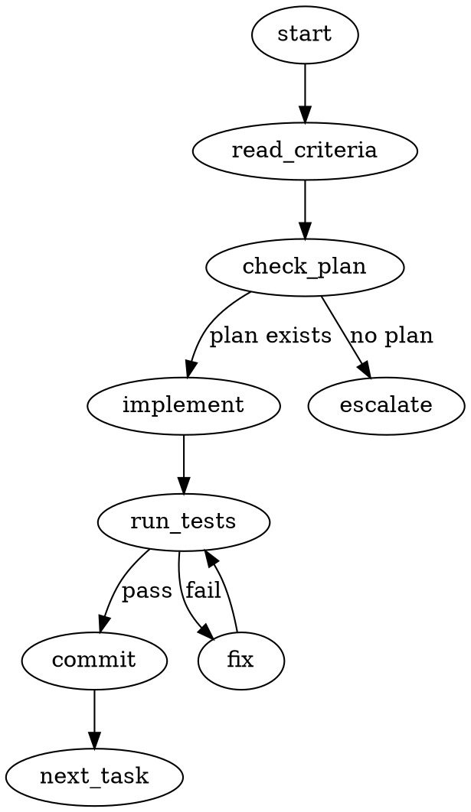

## Name

`ai-dlc:execute` - Run the autonomous AI-DLC execution loop.

## Synopsis

```
/ai-dlc:execute [intent-slug] [unit-name]
```

## Description

**User-facing command** - Continue the AI-DLC autonomous execution loop.

**Two modes:**
- `/ai-dlc:execute` — DAG-driven, behavior depends on `change_strategy`
- `/ai-dlc:execute unit-01-backend` — target a specific unit (precheck deps first)
- `/ai-dlc:execute my-feature unit-01-backend` — with explicit intent slug

This command resumes work from the current hat and runs until:
- All units complete (`/ai-dlc:advance` completes the intent automatically)
- User intervention needed (all units blocked)
- Session exhausted (Stop hook instructs agent to call `/ai-dlc:execute`)

**User Flow:**
```
User: /ai-dlc:elaborate           # Once - define intent, criteria, and workflow
User: /ai-dlc:execute             # Kicks off autonomous loop
...AI works autonomously across all units...
...session exhausts, Stop hook fires...
Agent: /ai-dlc:execute            # Agent continues (subagents have clean context)
...repeat until all units complete...
AI: Intent complete! [summary]
```

**Important:**
- Fully autonomous - Agent continues across units without stopping
- Subagents have clean context - No `/clear` needed between iterations
- User intervention - Only required when ALL units are blocked
- State preserved - Progress saved in `.ai-dlc/{slug}/state/` between sessions
- Clean context recommended - Run `/clear` before `/ai-dlc:execute` if prior conversation exists

**CRITICAL: No Questions During Execution**

During the execution loop, you MUST NOT:
- Use AskUserQuestion tool
- Ask clarifying questions
- Request user decisions
- Pause for user feedback

This breaks the hook logic. The execution loop must be fully autonomous.

If you encounter ambiguity:
1. Make a reasonable decision based on available context
2. Document the assumption in your work
3. Let the reviewer hat catch issues on the next pass

If truly blocked (cannot proceed without user input):
1. Document the blocker clearly in `dlc_state_save "$INTENT_DIR" "blockers.md"`
2. Stop the loop naturally (don't call /ai-dlc:advance)
3. The Stop hook will alert the user that human intervention is required

## Implementation

## Step -1: Context Window Preflight

Before starting the execution loop, check that the context window is reasonably clear. A full context window means the orchestrator can't manage the build loop effectively.

**Check:** If this is the START of a conversation (no prior messages beyond system prompts and the /ai-dlc:execute invocation), proceed directly.

**Check:** If there is significant prior conversation context (e.g., elaboration discussion, debugging, etc.), recommend clearing first:

```
⚠️ Your context window has significant prior content. The execution loop works best with a clean context.

Run `/clear` then `/ai-dlc:execute` to start fresh. Your progress is saved in state files — nothing will be lost.
```

If the user explicitly says to continue anyway, proceed — but note that the execution loop may hit context limits sooner and need more session restarts.

### Process Authority: DOT Flowcharts

When a hat or skill contains a DOT flowchart, the flowchart is the **authoritative process definition**. Prose descriptions are supporting context only.

**The Description Trap:** Agents naturally follow the shortest description they can find. If a 2-sentence summary exists alongside a detailed flowchart, the agent will follow the summary and skip the flowchart's nuance. To prevent this:

1. When a DOT flowchart exists, follow it node-by-node
2. Do NOT substitute prose summaries for flowchart steps
3. Each flowchart node represents a discrete action — execute them in order
4. Branch conditions in the flowchart are decision points — evaluate each explicitly

**Example DOT in a hat file:**


When present, this graph IS the process. The surrounding markdown explains WHY, not WHAT.


### Hard Gates

Hard gates are named checkpoints that MUST be satisfied before the workflow advances. Unlike hat transitions (which rely on agent judgment), hard gates are explicit conditions verified programmatically.

| Gate | Between | Condition | Enforcement |
|------|---------|-----------|-------------|
| `PLAN_APPROVED` | planner -> builder | Plan saved to `.ai-dlc/{slug}/state/`, all criteria have planned tasks | Check plan exists and covers all criteria |
| `TESTS_PASS` | builder -> reviewer | All quality gates (tests, lint, types) pass | Run test suite, verify exit code 0 |
| `CRITERIA_MET` | reviewer -> advance | Each criterion has PASS with evidence | Parse structured completion marker |

### Gate Enforcement

Before advancing to the next hat, verify the gate condition:

```bash
# Example: TESTS_PASS gate before reviewer
if ! verify_gate "TESTS_PASS"; then
  echo "## HARD GATE: TESTS_PASS"
  echo ""
  echo "Cannot advance to reviewer — quality gates are not passing."
  echo "Fix failing tests/lint/types before requesting review."
  exit 1
fi
```

Gates are checked by the `/ai-dlc:advance` skill. If a gate fails, advance is blocked and the agent must fix the issue before retrying.

**An agent MUST NEVER skip a hard gate.** Hard gates exist to prevent the most common workflow failures:
- Reviewing code that doesn't compile
- Building without a plan
- Marking criteria met without evidence

### Pre-check: Reject Cowork Mode

Execution requires full CLI capabilities (file editing, worktrees, test execution, subagent teams). It cannot run in a cowork session.

```bash
if [ "${CLAUDE_CODE_IS_COWORK:-}" = "1" ]; then
  echo "ERROR: /ai-dlc:execute cannot run in cowork mode."
  echo "Execution requires a full Claude Code CLI session with file system access."
  echo ""
  echo "To continue:"
  echo "  1. Open Claude Code in your project directory"
  echo "  2. Run /ai-dlc:execute"
  exit 1
fi
```

If `CLAUDE_CODE_IS_COWORK=1`, stop immediately with the message above. Do NOT proceed to any further steps.

### Step 0: Ensure Intent Worktree

**CRITICAL: The orchestrator MUST run in the intent worktree, not the main working directory.**

Before loading state, discover all active intents from `ai-dlc/*` branches:

```bash
# Source DAG library for branch discovery
source "${CLAUDE_PLUGIN_ROOT}/lib/dag.sh"

# Discover active intents from branches (worktrees, local, remote)
declare -A ACTIVE_INTENTS  # slug -> "source"

while IFS='|' read -r slug workflow source branch; do
  [ -z "$slug" ] && continue
  ACTIVE_INTENTS[$slug]="$source"
done < <(discover_branch_intents true)

# Handle results
if [ ${#ACTIVE_INTENTS[@]} -eq 0 ]; then
  echo "No active AI-DLC intent found."
  echo ""
  echo "Run /ai-dlc:elaborate to start a new task, or /ai-dlc:resume <slug> if you know the intent slug."
  exit 0
fi

if [ ${#ACTIVE_INTENTS[@]} -eq 1 ]; then
  # Single intent — use it
  INTENT_SLUG="${!ACTIVE_INTENTS[@]}"
elif [ ${#ACTIVE_INTENTS[@]} -gt 1 ]; then
  # Multiple intents — ask the user which one to execute
  echo "Multiple active intents found:"
  echo ""
  for slug in "${!ACTIVE_INTENTS[@]}"; do
    echo "- **$slug** (${ACTIVE_INTENTS[$slug]})"
  done
  echo ""
  echo "Use /ai-dlc:execute <slug> to specify which intent to execute."
  exit 0
fi

# Ensure we're in the intent worktree
REPO_ROOT=$(git worktree list --porcelain | head -1 | sed 's/^worktree //')
INTENT_BRANCH="ai-dlc/${INTENT_SLUG}/main"
INTENT_WORKTREE="${REPO_ROOT}/.ai-dlc/worktrees/${INTENT_SLUG}"

mkdir -p "${REPO_ROOT}/.ai-dlc/worktrees"
if ! grep -q '\.ai-dlc/worktrees/' "${REPO_ROOT}/.gitignore" 2>/dev/null; then
  echo '.ai-dlc/worktrees/' >> "${REPO_ROOT}/.gitignore"
  git add "${REPO_ROOT}/.gitignore"
  git commit -m "chore: gitignore .ai-dlc/worktrees"
fi

if [ ! -d "$INTENT_WORKTREE" ]; then
  # Always branch off the default branch
  source "${CLAUDE_PLUGIN_ROOT}/lib/config.sh"
  DEFAULT_BRANCH=$(resolve_default_branch "auto" "$REPO_ROOT")
  git worktree add -B "$INTENT_BRANCH" "$INTENT_WORKTREE" "$DEFAULT_BRANCH"

  # Record worktree creation telemetry
  source "${CLAUDE_PLUGIN_ROOT}/lib/telemetry.sh"
  aidlc_telemetry_init
  aidlc_record_worktree_event "created" "${INTENT_WORKTREE}"
fi

cd "$INTENT_WORKTREE"
```

**Important:** The orchestrator runs in `.ai-dlc/worktrees/{intent-slug}/`, NOT the original repo directory. This keeps main clean and enables parallel intents.

### Step 0a: Parse Unit Target

If arguments were provided to `/ai-dlc:execute`, disambiguate them:

```bash
# Arguments: /ai-dlc:execute [arg1] [arg2]
# Disambiguation:
#   - If arg starts with "unit-" or matches a unit file in INTENT_DIR: treat as unit target
#   - Otherwise: treat as intent slug
#   - /ai-dlc:execute my-feature unit-01-backend → intent=my-feature, unit=unit-01-backend
#   - /ai-dlc:execute unit-01-backend → intent=(auto-detected), unit=unit-01-backend

TARGET_UNIT=""
INTENT_DIR=".ai-dlc/${INTENT_SLUG}"

# Parse argument(s) into TARGET_UNIT
for arg in "$@"; do
  if [[ "$arg" == unit-* ]] || [ -f "$INTENT_DIR/${arg}.md" ] || [ -f "$INTENT_DIR/unit-${arg}.md" ]; then
    # Normalize: prepend "unit-" if needed
    if [[ "$arg" != unit-* ]] && [ -f "$INTENT_DIR/unit-${arg}.md" ]; then
      TARGET_UNIT="unit-${arg}"
    else
      TARGET_UNIT="$arg"
    fi
  fi
done
```

When a unit target is provided:

1. **Validate the unit file exists:**

```bash
if [ -n "$TARGET_UNIT" ]; then
  UNIT_FILE="$INTENT_DIR/${TARGET_UNIT}.md"
  if [ ! -f "$UNIT_FILE" ]; then
    echo "Unit not found: ${TARGET_UNIT}"
    echo ""
    echo "Available units:"
    for f in "$INTENT_DIR"/unit-*.md; do
      [ -f "$f" ] && echo "  - $(basename "$f" .md)"
    done
    exit 1
  fi

  # 2. Check dependency status
  source "${CLAUDE_PLUGIN_ROOT}/lib/dag.sh"
  DEP_STATUS=$(get_unit_dep_status "$INTENT_DIR" "$TARGET_UNIT")
  if [ $? -ne 0 ]; then
    echo "## Blocked: ${TARGET_UNIT}"
    echo ""
    echo "This unit has unmet dependencies:"
    echo ""
    echo "$DEP_STATUS"
    exit 1
  fi

  # 3. Check if already completed
  UNIT_STATUS=$(parse_unit_status "$UNIT_FILE")
  if [ "$UNIT_STATUS" = "completed" ]; then
    echo "Unit already completed: ${TARGET_UNIT}"
    exit 0
  fi
fi
```

### Step 0b: Ensure Remote Tracking

Ensure the intent branch tracks the remote so teammates can push their unit branches. This applies whether we're in a cloned cowork workspace or a local repo with a remote.

```bash
# Verify remote exists and configure upstream tracking
if git remote get-url origin &>/dev/null; then
  INTENT_BRANCH="ai-dlc/${INTENT_SLUG}/main"

  # Ensure the intent branch tracks the remote
  git branch --set-upstream-to=origin/"$INTENT_BRANCH" 2>/dev/null || true

  # Pull latest before starting to pick up teammate work
  git pull --rebase 2>/dev/null || true

  # Push intent branch to remote so teammates can access it
  git push -u origin "$INTENT_BRANCH" 2>/dev/null || true
fi
```

### Step 0c: Provider Sync Check

Check if a ticketing provider is configured and warn if ticket fields are unpopulated. This is a **warning only** — execution proceeds regardless. The elaboration gate (Phase 6.75) is the hard enforcement point; this catches cases where elaboration predated provider configuration.

```bash
source "${CLAUDE_PLUGIN_ROOT}/lib/config.sh"
PROVIDERS=$(load_providers)
TICKETING_TYPE=$(echo "$PROVIDERS" | jq -r '.ticketing.type // empty')

if [ -n "$TICKETING_TYPE" ]; then
  INTENT_DIR=".ai-dlc/${INTENT_SLUG}"
  MISSING=""

  # Check epic field in intent.md
  if [ -f "$INTENT_DIR/intent.md" ]; then
    EPIC=$(dlc_frontmatter_get "epic" "$INTENT_DIR/intent.md" 2>/dev/null || echo "")
    if [ -z "$EPIC" ]; then
      MISSING="${MISSING}\n- intent.md: epic field is empty"
    fi
  fi

  # Check ticket field in each unit file
  for unit_file in "$INTENT_DIR"/unit-*.md; do
    [ -f "$unit_file" ] || continue
    TICKET=$(dlc_frontmatter_get "ticket" "$unit_file" 2>/dev/null || echo "")
    if [ -z "$TICKET" ]; then
      MISSING="${MISSING}\n- $(basename "$unit_file"): ticket field is empty"
    fi
  done

  if [ -n "$MISSING" ]; then
    echo ""
    echo "> **WARNING: Ticketing provider '${TICKETING_TYPE}' is configured but some ticket fields are empty:**"
    echo -e "$MISSING"
    echo ">"
    echo "> Consider running \`/ai-dlc:elaborate\` to sync tickets, or populate fields manually."
    echo ""
  fi
fi
```

### Step 1: Load State

```bash
# Intent-level state is stored in .ai-dlc/{slug}/state/
INTENT_DIR=".ai-dlc/${INTENT_SLUG}"
STATE=$(dlc_state_load "$INTENT_DIR" "iteration.json")
# INTENT_SLUG already derived from Step 0
```

If `INTENT_SLUG` is empty (no intent exists at all):
```
No AI-DLC state found.

If you have existing intent artifacts in .ai-dlc/, run /ai-dlc:resume to continue.
Otherwise, run /ai-dlc:elaborate to start a new task.
```

If `INTENT_SLUG` exists but `STATE` is empty (first execution run — elaboration wrote artifacts but no iteration state):

Initialize `iteration.json` from the intent artifacts:

```bash
INTENT_DIR=".ai-dlc/${INTENT_SLUG}"
INTENT_FILE="$INTENT_DIR/intent.md"

# Read workflow from intent.md frontmatter
WORKFLOW_NAME=$(dlc_frontmatter_get "workflow" "$INTENT_FILE" 2>/dev/null || echo "default")

# Resolve workflow to hat sequence
if [ -f ".ai-dlc/workflows.yml" ]; then
  WORKFLOW_HATS=$(dlc_frontmatter_get "${WORKFLOW_NAME}" ".ai-dlc/workflows.yml" 2>/dev/null || echo "")
fi
if [ -z "$WORKFLOW_HATS" ] && [ -f "${CLAUDE_PLUGIN_ROOT}/workflows.yml" ]; then
  WORKFLOW_HATS=$(dlc_frontmatter_get "${WORKFLOW_NAME}" "${CLAUDE_PLUGIN_ROOT}/workflows.yml" 2>/dev/null || echo "")
fi
FIRST_HAT=$(echo "$WORKFLOW_HATS" | jq -r '.[0]')

# Initialize iteration state
STATE='{"iteration":1,"hat":"'"${FIRST_HAT}"'","workflowName":"'"${WORKFLOW_NAME}"'","workflow":'"${WORKFLOW_HATS}"',"status":"active"}'
dlc_state_save "$INTENT_DIR" "iteration.json" "$STATE"
```

If status is "completed":
```
Task already complete! Run /ai-dlc:reset to start a new task.
```

**Persist or clear targetUnit in state:**

```bash
# If targeting: save to state
if [ -n "$TARGET_UNIT" ]; then
  STATE=$(echo "$STATE" | dlc_json_set "targetUnit" "$TARGET_UNIT")
else
  # Clear any stale targetUnit from previous targeted run
  STATE=$(echo "$STATE" | dlc_json_set "targetUnit" "")
fi
dlc_state_save "$INTENT_DIR" "iteration.json" "$STATE"
```

### State Persistence

During execution, maintain a `STATE.md` file in the intent directory as a human-readable snapshot of current progress:

```markdown
# State: {intent title}

## Current Position
- **Hat:** {current hat}
- **Unit:** {current unit}
- **Bolt:** {iteration number}

## Decisions Made
- {decision 1}: {rationale}

## Blockers
- {blocker}: {status}

## Metrics
- Units complete: {n}/{total}
- Iterations: {count}
```

Update STATE.md at each hat transition and unit completion. This survives context resets and session boundaries better than ephemeral state.

Use the file-based state helpers from `lib/state.sh`:

```bash
source "${CLAUDE_PLUGIN_ROOT}/lib/state.sh"

# Write the full STATE.md
write_state_file "$INTENT_DIR" "STATE.md" "$state_content"

# Read it back
current_state=$(read_state_file "$INTENT_DIR" "STATE.md")

# Update just one section (lockfile-protected)
update_state_section "$INTENT_DIR" "Current Position" "- **Hat:** builder
- **Unit:** unit-02-api
- **Bolt:** 3"
```

### Step 1b: Detect Agent Teams

```bash
AGENT_TEAMS_ENABLED="${CLAUDE_CODE_EXPERIMENTAL_AGENT_TEAMS:-}"
CHANGE_STRATEGY=$(dlc_frontmatter_get "git.change_strategy" "$INTENT_DIR/intent.md" 2>/dev/null || echo "unit")

# Pure unit strategy always uses Sequential path (subagent delegation, no team orchestration).
# Hybrid strategy (intent-level "intent" + some units overriding to "unit") keeps Teams enabled —
# the intent-level strategy drives orchestration. Per-unit overrides are resolved at merge time
# by /ai-dlc:advance, not at spawn time.
if [ "$CHANGE_STRATEGY" = "unit" ]; then
  AGENT_TEAMS_ENABLED=""
fi
```

If `AGENT_TEAMS_ENABLED` is set, follow the **Agent Teams** path below.
If not set, skip to the **Fallback: Sequential Subagent Execution** section.

### Wave-Based Parallel Execution

When Agent Teams are enabled, units can be grouped into dependency waves for parallel execution:

**Wave Resolution:**
1. **Wave 0** — Units with no dependencies (can start immediately)
2. **Wave 1** — Units whose dependencies are all in Wave 0
3. **Wave N** — Units whose dependencies are all in Waves 0 through N-1

```bash
# Resolve waves from DAG
source "${CLAUDE_PLUGIN_ROOT}/lib/dag.sh"
# Wave 0: units with empty depends_on
# Wave 1: units whose depends_on are all in wave 0
# etc.
```

**Execution:**
- All units within a wave execute in parallel (separate subagents with fresh context)
- A wave completes only when ALL its units pass review
- The next wave starts only after the previous wave completes
- If a unit in wave N fails, it blocks wave N+1 but not other units in wave N

**Benefits over sequential execution:**
- Independent units don't wait for each other
- Each subagent gets fresh context (no degradation from prior unit's work)
- Natural synchronization at wave boundaries

**When to use:**
- Intents with 3+ units
- When Agent Teams (`CLAUDE_CODE_EXPERIMENTAL_AGENT_TEAMS`) is enabled
- When the intent strategy is `intent` (all work on one branch)

**Sequential fallback:** Without Agent Teams, continue executing units one at a time in DAG order.

### Step 2 (Teams): Create or Reconnect Team

Check if the team already exists before creating:

```bash
TEAM_NAME="ai-dlc-${INTENT_SLUG}"
TEAM_CONFIG="${CLAUDE_CONFIG_DIR}/teams/${TEAM_NAME}/config.json"
```

If team config does NOT exist:

```javascript
TeamCreate({
  team_name: `ai-dlc-${intentSlug}`,
  description: `AI-DLC: ${intentTitle}`
})
```

Save `teamName` to `iteration.json`:

```bash
STATE=$(echo "$STATE" | dlc_json_set "teamName" "$TEAM_NAME")
dlc_state_save "$INTENT_DIR" "iteration.json" "$STATE"
```

### Step 3 (Teams): Spawn ALL Ready Units in Parallel

Loop over ALL ready units from the DAG (not just one):

```bash
source "${CLAUDE_PLUGIN_ROOT}/lib/dag.sh"

# Read active_pass from intent frontmatter for pass-filtered selection
ACTIVE_PASS=$(dlc_frontmatter_get "active_pass" "$INTENT_DIR/intent.md" 2>/dev/null || echo "")

if [ -n "$ACTIVE_PASS" ]; then
  READY_UNITS=$(find_ready_units_for_pass "$INTENT_DIR" "$ACTIVE_PASS")
else
  READY_UNITS=$(find_ready_units "$INTENT_DIR")
fi

# Intent-level workflow (default fallback)
INTENT_WORKFLOW_HATS=$(echo "$STATE" | dlc_json_get "workflow")

# If no ready units and active_pass is set, check if the pass is complete
# (all units for this pass are completed, not just blocked)
if [ -z "$READY_UNITS" ] && [ -n "$ACTIVE_PASS" ]; then
  PASS_COMPLETE=true
  for unit_file in "$INTENT_DIR"/unit-*.md; do
    [ -f "$unit_file" ] || continue
    unit_pass=$(parse_unit_pass "$unit_file")
    [ "$unit_pass" != "$ACTIVE_PASS" ] && continue
    unit_status=$(parse_unit_status "$unit_file")
    if [ "$unit_status" != "completed" ]; then
      PASS_COMPLETE=false
      break
    fi
  done

  if [ "$PASS_COMPLETE" = "true" ]; then
    # All units for this pass are done — trigger pass transition (Step 5b logic)
    # Skip to team shutdown / pass transition rather than declaring "all blocked"
    echo "PASS_COMPLETE: All units for pass '$ACTIVE_PASS' are completed."
    # Flow continues to Step 5 (Teams): Integration Validation and Team Shutdown
  fi
fi
```

**Include repo URL for cowork**: If operating in a cloned workspace, include the repo URL in each teammate's prompt: "Repository: `<remote-url>`. Clone and checkout `ai-dlc/<intent-slug>` if you don't have local access." This enables teammates to clone independently in cowork mode.

```bash
# Capture remote URL for teammate prompts
REPO_URL=$(git remote get-url origin 2>/dev/null || echo "")
```

For EACH ready unit:

1. **Create unit worktree** (same as current Step 2 logic):

```bash
UNIT_NAME=$(basename "$UNIT_FILE" .md)
UNIT_SLUG="${UNIT_NAME#unit-}"
UNIT_BRANCH="ai-dlc/${INTENT_SLUG}/${UNIT_SLUG}"
WORKTREE_PATH="${REPO_ROOT}/.ai-dlc/worktrees/${INTENT_SLUG}-${UNIT_SLUG}"

if [ ! -d "$WORKTREE_PATH" ]; then
  # Always branch off the default branch
  source "${CLAUDE_PLUGIN_ROOT}/lib/config.sh"
  DEFAULT_BRANCH=$(resolve_default_branch "auto" "$REPO_ROOT")
  git worktree add -B "$UNIT_BRANCH" "$WORKTREE_PATH" "$DEFAULT_BRANCH"

  # Record worktree creation telemetry
  source "${CLAUDE_PLUGIN_ROOT}/lib/telemetry.sh"
  aidlc_telemetry_init
  aidlc_record_worktree_event "created" "${WORKTREE_PATH}"
fi
```

2. **Mark unit as in_progress**:

```bash
update_unit_status "$UNIT_FILE" "in_progress"
# Commit the status change so it persists across sessions
git add "$UNIT_FILE"
git commit -m "status: mark $(basename "$UNIT_FILE" .md) as in_progress"
```

3. **Resolve per-unit workflow** — read the unit's `workflow:` frontmatter field. If present, resolve it to a hat sequence. If absent, check for discipline-based defaults before falling back to the intent-level workflow:

```bash
UNIT_WORKFLOW_NAME=$(dlc_frontmatter_get "workflow" "$UNIT_FILE" 2>/dev/null || echo "")

# Discipline-based fallback: auto-route discipline: design → workflow: design
if [ -z "$UNIT_WORKFLOW_NAME" ]; then
  UNIT_DISCIPLINE=$(dlc_frontmatter_get "discipline" "$UNIT_FILE" 2>/dev/null || echo "")
  case "$UNIT_DISCIPLINE" in
    design)          UNIT_WORKFLOW_NAME="design" ;;
    infrastructure)  UNIT_WORKFLOW_NAME="default" ;;
    observability)   UNIT_WORKFLOW_NAME="default" ;;
    *)               ;;  # fall through to intent-level
  esac
fi

if [ -n "$UNIT_WORKFLOW_NAME" ]; then
  # Resolve unit-specific workflow
  UNIT_WORKFLOW_HATS=""
  if [ -f ".ai-dlc/workflows.yml" ]; then
    UNIT_WORKFLOW_HATS=$(dlc_frontmatter_get "${UNIT_WORKFLOW_NAME}.hats" ".ai-dlc/workflows.yml" 2>/dev/null || echo "")
  fi
  if [ -z "$UNIT_WORKFLOW_HATS" ] && [ -f "${CLAUDE_PLUGIN_ROOT}/workflows.yml" ]; then
    UNIT_WORKFLOW_HATS=$(dlc_frontmatter_get "${UNIT_WORKFLOW_NAME}.hats" "${CLAUDE_PLUGIN_ROOT}/workflows.yml" 2>/dev/null || echo "")
  fi
  [ -z "$UNIT_WORKFLOW_HATS" ] && UNIT_WORKFLOW_HATS="$INTENT_WORKFLOW_HATS"
else
  UNIT_WORKFLOW_HATS="$INTENT_WORKFLOW_HATS"
fi

# Apply pass-level workflow constraint if active_pass is set
if [ -n "$ACTIVE_PASS" ] && [ -n "$UNIT_WORKFLOW_NAME" ]; then
  source "${CLAUDE_PLUGIN_ROOT}/lib/pass.sh"
  CONSTRAINED_WORKFLOW=$(constrain_workflow "$ACTIVE_PASS" "$UNIT_WORKFLOW_NAME")
  if [ "$CONSTRAINED_WORKFLOW" != "$UNIT_WORKFLOW_NAME" ]; then
    echo "Note: Workflow '$UNIT_WORKFLOW_NAME' not available in '$ACTIVE_PASS' pass. Using '$CONSTRAINED_WORKFLOW'."
    UNIT_WORKFLOW_NAME="$CONSTRAINED_WORKFLOW"
    # Re-resolve hats for the constrained workflow
    UNIT_WORKFLOW_HATS=""
    if [ -f ".ai-dlc/workflows.yml" ]; then
      UNIT_WORKFLOW_HATS=$(dlc_frontmatter_get "${UNIT_WORKFLOW_NAME}.hats" ".ai-dlc/workflows.yml" 2>/dev/null || echo "")
    fi
    if [ -z "$UNIT_WORKFLOW_HATS" ] && [ -f "${CLAUDE_PLUGIN_ROOT}/workflows.yml" ]; then
      UNIT_WORKFLOW_HATS=$(dlc_frontmatter_get "${UNIT_WORKFLOW_NAME}.hats" "${CLAUDE_PLUGIN_ROOT}/workflows.yml" 2>/dev/null || echo "")
    fi
    [ -z "$UNIT_WORKFLOW_HATS" ] && UNIT_WORKFLOW_HATS="$INTENT_WORKFLOW_HATS"
  fi
fi

FIRST_HAT=$(echo "$UNIT_WORKFLOW_HATS" | jq -r '.[0]')
```

4. **Track unit hat in unit frontmatter** (per-unit hat derived from unit-*.md + DAG):

```bash
# Per-unit hat tracking is derived from unit frontmatter status and the DAG.
# The unit's current workflow position is determined by its status field
# and the workflow defined in unit frontmatter or intent-level fallback.
dlc_frontmatter_set "hat" "${FIRST_HAT}" "$INTENT_DIR/${UNIT_NAME}.md"
git add "$INTENT_DIR/${UNIT_NAME}.md"
git commit -m "status: set hat for ${UNIT_NAME}"
```

5. **Load hat instructions for the first hat**:

```bash
# Load hat instructions using augmentation pattern (plugin hat + project augmentation)
source "${CLAUDE_PLUGIN_ROOT}/lib/hat.sh"
HAT_INSTRUCTIONS=$(load_hat_instructions "${FIRST_HAT}")
```

5. **Select agent type based on hat**:

- `planner` -> `general-purpose` agent (NOT `Plan` — the planner hat writes its own plan directly, plan mode blocks autonomous execution)
- `builder` -> discipline-specific agent (see builder agent selection table below)
- All other hats (`reviewer`, `red-team`, `blue-team`, etc.) -> `general-purpose` agent

6. **Resolve model profile for the hat**:

```bash
source "${CLAUDE_PLUGIN_ROOT}/lib/config.sh"
SETTINGS_JSON=$(load_repo_settings "$(find_repo_root)")
MODEL_PROFILE=$(echo "$SETTINGS_JSON" | jq -r ".model_profiles.${HAT_NAME} // \"inherit\"" 2>/dev/null || echo "inherit")
```

If `MODEL_PROFILE` is not `inherit`, pass the `model` parameter when spawning the subagent. This lets teams route expensive reasoning to Opus for planning while using Sonnet or Haiku for implementation, significantly reducing cost.

**Example configurations** for `settings.yml` (these are reference patterns, not named profiles you can set by name — configure per-hat tiers directly):

| Pattern | Planner | Builder | Reviewer | Use Case |
|---------|---------|---------|----------|----------|
| Quality | opus | opus | opus | Maximum quality, highest cost |
| Balanced | opus | sonnet | sonnet | Good planning, fast execution |
| Budget | sonnet | haiku | sonnet | Cost-efficient, adequate quality |
| (default) | inherit | inherit | inherit | Use session model for everything |

7. **Create shared task via TaskCreate**:

```javascript
TaskCreate({
  subject: `${FIRST_HAT}: ${unitName}`,
  description: `Execute ${FIRST_HAT} role for unit ${unitName}. Worktree: ${WORKTREE_PATH}`,
  activeForm: `${FIRST_HAT}: ${unitName}`
})
```

8. **Spawn teammate with hat instructions in prompt**:

```javascript
Task({
  subagent_type: getAgentTypeForHat(FIRST_HAT, unit.discipline),
  model: MODEL_PROFILE !== "inherit" ? MODEL_PROFILE : undefined,
  description: `${FIRST_HAT}: ${unitName}`,
  name: `${FIRST_HAT}-${unitSlug}`,
  team_name: `ai-dlc-${intentSlug}`,

  prompt: `
    Execute the ${FIRST_HAT} role for unit ${unitName}.

    ## Your Role: ${FIRST_HAT}
    ${HAT_INSTRUCTIONS}

    ## CRITICAL: Work in Worktree
    **Worktree path:** ${WORKTREE_PATH}
    **Branch:** ${UNIT_BRANCH}

    You MUST:
    1. cd ${WORKTREE_PATH}
    2. Verify you're on branch ${UNIT_BRANCH}
    3. Do ALL work in that directory
    4. Commit changes to that branch

    ## Repository Access (Cowork)
    If the worktree at ${WORKTREE_PATH} doesn't exist, clone from the remote:
    ```bash
    REPO_URL=$(git remote get-url origin 2>/dev/null || echo "")
    if [ -n "$REPO_URL" ] && [ ! -d "${WORKTREE_PATH}" ]; then
      git clone "$REPO_URL" "${WORKTREE_PATH}"
      cd "${WORKTREE_PATH}"
      git checkout "${UNIT_BRANCH}"
    fi
    ```

    ## Unit: ${unitName}
    ## Completion Criteria
    ${unit.criteria}

    Work according to your role. Report completion via SendMessage to the team lead when done.
  `
})
```


### Step 4 (Teams): Monitor and React Loop

The lead processes auto-delivered teammate messages. Handle each event type:

#### Teammate Completes (Any Hat)

When a teammate reports successful completion:

1. Read current hat for this unit from unit frontmatter (`dlc_frontmatter_get "hat" "$UNIT_FILE"`)
2. Read this unit's workflow from unit frontmatter or intent-level fallback
3. Find current hat's index in the unit's workflow array
4. Determine next hat: `unitWorkflow[currentIndex + 1]`

**If next hat exists** (not at end of workflow):

a. Update hat in unit frontmatter: `dlc_frontmatter_set "hat" "$nextHat" "$UNIT_FILE"`
b. Commit: `git add "$UNIT_FILE" && git commit -m "status: advance hat for $(basename "$UNIT_FILE" .md)"`
c. Load hat instructions for nextHat using augmentation pattern:

```bash
source "${CLAUDE_PLUGIN_ROOT}/lib/hat.sh"
HAT_INSTRUCTIONS=$(load_hat_instructions "${nextHat}")
```

d. Select agent type based on hat:
   - `planner` -> `general-purpose` agent (NOT `Plan` — plan mode blocks autonomous execution)
   - `builder` -> discipline-specific agent (see builder agent selection table below)
   - All other hats (`reviewer`, `red-team`, `blue-team`, etc.) -> `general-purpose` agent

e. Resolve model profile for the hat (same as step 6 above):
   ```bash
   MODEL_PROFILE=$(echo "$SETTINGS_JSON" | jq -r ".model_profiles.${HAT_NAME} // \"inherit\"" 2>/dev/null || echo "inherit")
   ```

f. Spawn teammate with hat instructions in prompt:

```javascript
Task({
  subagent_type: getAgentTypeForHat(nextHat, unit.discipline),
  model: MODEL_PROFILE !== "inherit" ? MODEL_PROFILE : undefined,
  description: `${nextHat}: ${unitName}`,
  name: `${nextHat}-${unitSlug}`,
  team_name: `ai-dlc-${intentSlug}`,

  prompt: `
    Execute the ${nextHat} role for unit ${unitName}.

    ## Your Role: ${nextHat}
    ${HAT_INSTRUCTIONS}

    ## CRITICAL: Work in Worktree
    **Worktree path:** ${WORKTREE_PATH}
    **Branch:** ${UNIT_BRANCH}

    You MUST:
    1. cd ${WORKTREE_PATH}
    2. Verify you're on branch ${UNIT_BRANCH}
    3. Do ALL work in that directory
    4. Commit changes to that branch

    ## Repository Access (Cowork)
    If the worktree at ${WORKTREE_PATH} doesn't exist, clone from the remote:
    ```bash
    REPO_URL=$(git remote get-url origin 2>/dev/null || echo "")
    if [ -n "$REPO_URL" ] && [ ! -d "${WORKTREE_PATH}" ]; then
      git clone "$REPO_URL" "${WORKTREE_PATH}"
      cd "${WORKTREE_PATH}"
      git checkout "${UNIT_BRANCH}"
    fi
    ```

    ## Unit: ${unitName}
    ## Completion Criteria
    ${unit.criteria}

    Work according to your role. Report completion via SendMessage to the team lead when done.
  `
})
```

**If no next hat** (last hat in workflow -- unit complete):

a. Mark unit as completed and commit:
```bash
update_unit_status "$UNIT_FILE" "completed"
git add "$UNIT_FILE"
git commit -m "status: mark $(basename "$UNIT_FILE" .md) as completed"
```
b. Merge or PR based on effective change strategy:

```bash
# Determine merge behavior based on per-unit or intent-level change strategy
source "${CLAUDE_PLUGIN_ROOT}/lib/config.sh"
source "${CLAUDE_PLUGIN_ROOT}/lib/dag.sh"
INTENT_DIR=".ai-dlc/${INTENT_SLUG}"
CONFIG=$(get_ai_dlc_config "$INTENT_DIR")
AUTO_MERGE=$(echo "$CONFIG" | jq -r '.auto_merge // "true"')
AUTO_SQUASH=$(echo "$CONFIG" | jq -r '.auto_squash // "false"')
DEFAULT_BRANCH=$(echo "$CONFIG" | jq -r '.default_branch')

# Check per-unit change strategy override
UNIT_FILE="$INTENT_DIR/${UNIT_NAME}.md"
UNIT_CS=$(parse_unit_change_strategy "$UNIT_FILE")
EFFECTIVE_CS="${UNIT_CS:-$(echo "$CONFIG" | jq -r '.change_strategy // "unit"')}"
UNIT_BRANCH="ai-dlc/${INTENT_SLUG}/${UNIT_SLUG}"

if [ "$EFFECTIVE_CS" = "unit" ]; then
  # Per-unit strategy: create PR to default branch (same as advance/SKILL.md unit path)
  git push -u origin "$UNIT_BRANCH" 2>/dev/null || true

  UNIT_TICKET=$(dlc_frontmatter_get "ticket" "$UNIT_FILE" 2>/dev/null || echo "")
  TICKET_LINE=""
  [ -n "$UNIT_TICKET" ] && TICKET_LINE="Closes ${UNIT_TICKET}"

  PR_URL=$(gh pr create \
    --base "$DEFAULT_BRANCH" \
    --head "$UNIT_BRANCH" \
    --title "unit: ${UNIT_NAME}" \
    --body "## Unit: ${UNIT_NAME}

Part of intent: ${INTENT_SLUG}

${TICKET_LINE}

---
*Built with [AI-DLC](https://ai-dlc.dev)*" 2>&1) || echo "PR may already exist for $UNIT_BRANCH"

  source "${CLAUDE_PLUGIN_ROOT}/lib/telemetry.sh"
  aidlc_telemetry_init
  aidlc_record_delivery_created "${INTENT_SLUG}" "${CHANGE_STRATEGY}" "${PR_URL}"

  WORKTREE_PATH="${REPO_ROOT}/.ai-dlc/worktrees/${INTENT_SLUG}-${UNIT_SLUG}"
  if [ -d "$WORKTREE_PATH" ]; then
    git worktree remove "$WORKTREE_PATH" 2>/dev/null || echo "Warning: failed to remove worktree at $WORKTREE_PATH"

    # Record worktree deletion telemetry
    source "${CLAUDE_PLUGIN_ROOT}/lib/telemetry.sh"
    aidlc_telemetry_init
    aidlc_record_worktree_event "deleted" "${WORKTREE_PATH}"
  fi
  git worktree prune

elif [ "$AUTO_MERGE" = "true" ]; then
  # Intent strategy: merge unit branch into intent branch (existing behavior)
  git checkout "ai-dlc/${INTENT_SLUG}/main"

  if [ "$AUTO_SQUASH" = "true" ]; then
    git merge --squash "$UNIT_BRANCH"
    git commit -m "unit: ${UNIT_NAME} completed"
  else
    git merge --no-ff "$UNIT_BRANCH" -m "Merge ${UNIT_NAME} into intent branch"
  fi

  WORKTREE_PATH="${REPO_ROOT}/.ai-dlc/worktrees/${INTENT_SLUG}-${UNIT_SLUG}"
  if [ -d "$WORKTREE_PATH" ]; then
    git worktree remove "$WORKTREE_PATH" 2>/dev/null || echo "Warning: failed to remove worktree at $WORKTREE_PATH"

    # Record worktree deletion telemetry
    source "${CLAUDE_PLUGIN_ROOT}/lib/telemetry.sh"
    aidlc_telemetry_init
    aidlc_record_worktree_event "deleted" "${WORKTREE_PATH}"
  fi
  git worktree prune
fi
```

d. Check DAG for newly unblocked units
e. For each newly ready unit, spawn at `workflow[0]` (first hat):

```bash
FIRST_HAT=$(echo "$WORKFLOW_HATS" | jq -r '.[0]')
```

Then follow the same spawn logic from Step 3 (use `load_hat_instructions` from `hat.sh` for augmented hat resolution, select agent type, spawn teammate with hat instructions in prompt).

#### Teammate Reports Issues (Any Hat)

When a teammate reports issues or rejects the work:

1. Read current hat from unit frontmatter
2. Determine previous hat: `workflow[currentIndex - 1]`
3. Increment retry count in unit frontmatter (`dlc_frontmatter_get "retries" "$UNIT_FILE"`)
4. If `retries >= 3`: Mark unit as blocked, document in `dlc_state_save "$INTENT_DIR" "blockers.md"`
5. Otherwise: Update hat in unit frontmatter: `dlc_frontmatter_set "hat" "$previousHat" "$UNIT_FILE"`
6. Load hat instructions for previousHat using augmentation pattern (`load_hat_instructions`)
7. Spawn teammate at previous hat with the feedback/issues in the prompt

This means ANY hat can reject -- not just the reviewer. A red-team finding issues sends work back to the previous hat.

#### Blocked

1. Document the blocker in `dlc_state_save "$INTENT_DIR" "blockers.md"`
2. Check if ALL units are blocked
3. Before declaring "all blocked," check if the active pass's units are all completed — if so, this is a pass completion, not a blocker. Route to pass transition (Step 5b) instead.
4. If all blocked (and not a pass-complete scenario), alert user: "All units blocked. Human intervention required."

### Step 5 (Teams): Integration Validation and Team Shutdown

When all units complete:

#### 5a. Run Integration Validation

Before shutting down the team, run the `/ai-dlc:integrate` skill as a teammate on the **intent worktree** (not a unit worktree). Integration is implemented as an internal skill (see `plugin/skills/integrate/SKILL.md`), not a hat.

```bash
# Check if integration has already passed
INTEGRATOR_COMPLETE=$(echo "$STATE" | dlc_json_get "integratorComplete" "false")

# Count total units
UNIT_COUNT=$(ls -1 "$INTENT_DIR"/unit-*.md 2>/dev/null | wc -l)
```

Skip integration if:
- Only one unit (the reviewer already validated it)
- ALL units effectively use `unit` strategy (each unit reviewed individually via per-unit MR)

Note: In hybrid mode (intent-level `intent` + some units overriding to `unit`), integration still runs because non-unit units merge into the intent branch and need integration verification.

```bash
source "${CLAUDE_PLUGIN_ROOT}/lib/config.sh"
source "${CLAUDE_PLUGIN_ROOT}/lib/dag.sh"
CONFIG=$(get_ai_dlc_config "$INTENT_DIR")

# Hybrid-aware check: iterate all units to determine if ALL effectively use "unit" strategy
ALL_UNIT_STRATEGY=true
for unit_file in "$INTENT_DIR"/unit-*.md; do
  [ -f "$unit_file" ] || continue
  UNIT_CS=$(parse_unit_change_strategy "$unit_file")
  EFFECTIVE_CS="${UNIT_CS:-$(echo "$CONFIG" | jq -r '.change_strategy // "unit"')}"
  [ "$EFFECTIVE_CS" != "unit" ] && { ALL_UNIT_STRATEGY=false; break; }
done

SKIP_INTEGRATOR=false
[ "$UNIT_COUNT" -le 1 ] && SKIP_INTEGRATOR=true
[ "$ALL_UNIT_STRATEGY" = "true" ] && SKIP_INTEGRATOR=true
```

If `SKIP_INTEGRATOR` is false and `integratorComplete` is not `true`:

Spawn the integrate skill as a teammate:

```javascript
Task({
  subagent_type: "general-purpose",
  description: `integrate: ${intentSlug}`,
  name: `integrate-${intentSlug}`,
  team_name: `ai-dlc-${intentSlug}`,

  prompt: `
    Run the /ai-dlc:integrate skill for intent ${intentSlug}.

    ## CRITICAL: Work on Intent Branch
    **Worktree path:** .ai-dlc/worktrees/${intentSlug}/
    **Branch:** ai-dlc/${intentSlug}/main

    You MUST:
    1. cd .ai-dlc/worktrees/${intentSlug}/
    2. Verify you're on the intent branch (not a unit branch)
    3. This branch contains ALL merged unit work

    ## Intent-Level Success Criteria
    ${intentCriteria}

    ## Completed Units
    ${completedUnitsList}

    Verify that all units work together and intent-level criteria are met.
    Report ACCEPT or REJECT via SendMessage to the team lead.
  `
})
```

Handle integration result:

**If ACCEPT:** Set `integratorComplete = true`, proceed to shutdown below.

**If REJECT:** Re-queue rejected units (same logic as advance/SKILL.md Step 2e -- set status to `pending`, reset hat to first workflow hat). Spawn new teammates for re-queued units. Do NOT shut down the team.

#### 5b. Team Shutdown

After integration accepts (or if `integratorComplete` was already true):

1. Send shutdown requests to all active teammates:

```javascript
// For each active teammate
SendMessage({
  type: "shutdown_request",
  recipient: teammateName,
  content: "All units complete. Shutting down team."
})
```

2. Clean up team:

```javascript
TeamDelete()
```

3. **Check for next pass** before marking intent complete:

```bash
# Read pass configuration from intent.md
INTENT_DIR=".ai-dlc/${INTENT_SLUG}"
PASSES=$(grep '^passes:' "$INTENT_DIR/intent.md" | sed 's/passes: *//' | sed 's/\[//;s/\]//' | tr ',' '\n' | sed 's/ //g' | grep -v '^$')
ACTIVE_PASS=$(grep '^active_pass:' "$INTENT_DIR/intent.md" | sed 's/active_pass: *//' | tr -d '"')

if [ -n "$PASSES" ] && [ -n "$ACTIVE_PASS" ]; then
  # Find the next pass after the active one
  NEXT_PASS=""
  FOUND_ACTIVE=false
  for pass in $PASSES; do
    if [ "$FOUND_ACTIVE" = "true" ]; then
      NEXT_PASS="$pass"
      break
    fi
    [ "$pass" = "$ACTIVE_PASS" ] && FOUND_ACTIVE=true
  done

  if [ -n "$NEXT_PASS" ]; then
    # Validate next pass exists and load its description
    source "${CLAUDE_PLUGIN_ROOT}/lib/pass.sh"
    NEXT_PASS_DESC=""
    if validate_pass_exists "$NEXT_PASS"; then
      NEXT_PASS_META=$(load_pass_metadata "$NEXT_PASS")
      NEXT_PASS_DESC=$(echo "$NEXT_PASS_META" | jq -r '.description // ""')
    fi

    echo "PASS_TRANSITION: $ACTIVE_PASS -> $NEXT_PASS"
  fi
fi
```

**If a next pass exists:** Do NOT mark intent complete. Instead:
1. Update `active_pass` in intent.md frontmatter to the next pass
2. Notify the user with the next pass's description (from `load_pass_metadata`):
   - If description is available: "The **{active_pass}** pass is complete. The next pass is **{next_pass}** — {NEXT_PASS_DESC}. Run `/ai-dlc:elaborate` to define {next_pass} units using the artifacts from the {active_pass} pass."
   - If no description: "The **{active_pass}** pass is complete. The next pass is **{next_pass}**. Run `/ai-dlc:elaborate` to define {next_pass} units using the artifacts from the {active_pass} pass."
3. Save state with `status=pass_transition`
4. Stop execution — the user will re-elaborate for the next pass

**If no next pass** (last pass or no passes configured):

Mark intent complete:

```bash
STATE=$(echo "$STATE" | dlc_json_set "status" "completed")
dlc_state_save "$INTENT_DIR" "iteration.json" "$STATE"

# Update intent.md frontmatter status so it persists in git
source "${CLAUDE_PLUGIN_ROOT}/lib/parse.sh"
dlc_frontmatter_set "status" "completed" "$INTENT_DIR/intent.md"
# Check off intent-level completion criteria checkboxes
dlc_check_intent_criteria "$INTENT_DIR"
git add "$INTENT_DIR/intent.md"
git add "$INTENT_DIR/completion-criteria.md" 2>/dev/null || true
git add "$INTENT_DIR/state/completion-criteria.md" 2>/dev/null || true
git commit -m "status: mark intent ${INTENT_SLUG} as completed"

# Record intent completion telemetry
source "${CLAUDE_PLUGIN_ROOT}/lib/telemetry.sh"
aidlc_telemetry_init
UNIT_COUNT=$(ls "$INTENT_DIR"/unit-*.md 2>/dev/null | wc -l | tr -d ' ')
aidlc_record_intent_completed "${INTENT_SLUG}" "${UNIT_COUNT}"
```

4. Output completion summary (same as current Step 5 format from `/ai-dlc:advance`)

#### Pass-Back Mechanism

A pass-back occurs when a reviewer or late-pass hat determines that work needs to flow back to an earlier pass (e.g., the `dev` pass discovers that `design` artifacts are insufficient). The orchestrator detects a pass-back signal from a teammate's output — typically a structured message like `PASS_BACK: <target_pass>` with a reason.

When a pass-back is detected:

```bash
# Pass-back mechanism: set active_pass backward and stop for re-elaboration
PASS_BACK_TARGET="$TARGET_PASS"  # Set by orchestrator when pass-back detected

if [ -n "$PASS_BACK_TARGET" ]; then
  source "${CLAUDE_PLUGIN_ROOT}/lib/pass.sh"
  if ! validate_pass_exists "$PASS_BACK_TARGET"; then
    echo "Error: Pass-back target '$PASS_BACK_TARGET' is not a valid pass."
    exit 1
  fi

  # Update active_pass to the target pass
  dlc_frontmatter_set "active_pass" "$PASS_BACK_TARGET" "$INTENT_DIR/intent.md"
  git add "$INTENT_DIR/intent.md"
  git commit -m "pass-back: revert active_pass to $PASS_BACK_TARGET"

  # Save state
  STATE=$(echo "$STATE" | dlc_json_set "status" "pass_back")
  dlc_state_save "$INTENT_DIR" "iteration.json" "$STATE"

  echo ""
  echo "The current pass discovered issues requiring work in the **${PASS_BACK_TARGET}** pass."
  echo "Run \`/ai-dlc:elaborate\` to define new units for the ${PASS_BACK_TARGET} pass."
  exit 0
fi
```

The pass-back stops execution immediately. The user must re-elaborate for the target pass before resuming execution.

#### 5c. Delivery Prompt

**Pre-delivery validation:** Verify intent.md status is "completed" before delivering. This is a safety net — Step 5b should have set it, but if it was missed (e.g., stale plugin, skipped step), catch it here.

```bash
source "${CLAUDE_PLUGIN_ROOT}/lib/parse.sh"
INTENT_DIR=".ai-dlc/${INTENT_SLUG}"
INTENT_STATUS=$(dlc_frontmatter_get "status" "$INTENT_DIR/intent.md")
if [ "$INTENT_STATUS" != "completed" ]; then
  echo "Fixing: intent status '$INTENT_STATUS' → 'completed'"
  dlc_frontmatter_set "status" "completed" "$INTENT_DIR/intent.md"
  dlc_check_intent_criteria "$INTENT_DIR"
  git add "$INTENT_DIR/intent.md"
  git add "$INTENT_DIR/completion-criteria.md" 2>/dev/null || true
  git add "$INTENT_DIR/state/completion-criteria.md" 2>/dev/null || true
  git commit -m "status: mark intent ${INTENT_SLUG} as completed"
fi
```

### Pre-Delivery Code Review

Before creating the PR, review the full composed diff to catch cross-unit issues the per-unit reviewer couldn't see. **This is a hard gate — the PR cannot be created without passing.**

```bash
# Determine if we need pre-delivery review (intent/hybrid strategy only)
source "${CLAUDE_PLUGIN_ROOT}/lib/config.sh"
source "${CLAUDE_PLUGIN_ROOT}/lib/dag.sh"
INTENT_DIR=".ai-dlc/${INTENT_SLUG}"
CONFIG=$(get_ai_dlc_config "$INTENT_DIR")
CHANGE_STRATEGY=$(echo "$CONFIG" | jq -r '.change_strategy // "unit"')

NEEDS_DELIVERY_REVIEW=false
for unit_file in "$INTENT_DIR"/unit-*.md; do
  [ -f "$unit_file" ] || continue
  UNIT_CS=$(parse_unit_change_strategy "$unit_file")
  EFFECTIVE_CS="${UNIT_CS:-$CHANGE_STRATEGY}"
  [ "$EFFECTIVE_CS" != "unit" ] && { NEEDS_DELIVERY_REVIEW=true; break; }
done
```

**If `NEEDS_DELIVERY_REVIEW=true`:** Run the pre-delivery code review.

1. Compute the full diff against the default branch:

```bash
DEFAULT_BRANCH=$(git symbolic-ref refs/remotes/origin/HEAD 2>/dev/null | sed 's@^refs/remotes/origin/@@' || echo "main")
FULL_DIFF=$(git diff "${DEFAULT_BRANCH}...HEAD" 2>/dev/null || git diff "${DEFAULT_BRANCH}..HEAD")
DIFF_STAT=$(git diff --stat "${DEFAULT_BRANCH}...HEAD" 2>/dev/null || git diff --stat "${DEFAULT_BRANCH}..HEAD")
```

2. Review the full diff for these categories:
   - **Code quality**: naming consistency, dead code, unused imports, code duplication across units
   - **Security**: injection risks, hardcoded secrets, auth issues introduced by the composed changes
   - **Cross-unit integration**: conflicting patterns, inconsistent error handling, incompatible interfaces
   - **Standards**: formatting drift, convention violations visible only in the aggregate

3. Produce a structured decision:

```markdown
## PRE-DELIVERY REVIEW

**Diff stats:**
{DIFF_STAT}

**Decision:** APPROVED | REQUEST CHANGES

### Findings (if any)
- [HIGH] description — affected file(s)
- [MEDIUM] description — affected file(s)
- [LOW] description — affected file(s)

### Affected Units (if REQUEST CHANGES)
- unit-NN-name (reason)
```

4. **If Decision is APPROVED:**

```bash
# Record telemetry
source "${CLAUDE_PLUGIN_ROOT}/lib/telemetry.sh"
aidlc_telemetry_init
aidlc_record_delivery_review "${INTENT_SLUG}" "approved" "0"
```

Proceed to delivery.

5. **If Decision is REQUEST CHANGES:**

Only HIGH-confidence findings block delivery. MEDIUM and LOW findings are noted but do not block.

```bash
# Record telemetry
source "${CLAUDE_PLUGIN_ROOT}/lib/telemetry.sh"
aidlc_telemetry_init
aidlc_record_delivery_review "${INTENT_SLUG}" "rejected" "${ISSUE_COUNT}"
```

For each affected unit with HIGH findings:
- Identify the unit slug from the affected file paths
- Call `/ai-dlc:fail` with the reason: "Pre-delivery review found issues: {description}"
- The fail mechanism will revert the unit's hat to builder and re-enter the build loop

**After calling /ai-dlc:fail, STOP.** Do not proceed to delivery. The execution loop will resume with the builder addressing the findings.

**Gate on change strategy.** The delivery prompt only applies to intent-level strategy, where all unit work merges into a single intent branch that needs delivery. With unit strategy, each unit already has its own PR — there's nothing to deliver as a whole.

```bash
source "${CLAUDE_PLUGIN_ROOT}/lib/config.sh"
source "${CLAUDE_PLUGIN_ROOT}/lib/dag.sh"
INTENT_DIR=".ai-dlc/${INTENT_SLUG}"
CONFIG=$(get_ai_dlc_config "$INTENT_DIR")
CHANGE_STRATEGY=$(echo "$CONFIG" | jq -r '.change_strategy // "unit"')

# Check if ALL units effectively use unit strategy (including hybrid)
ALL_UNIT_STRATEGY=true
for unit_file in "$INTENT_DIR"/unit-*.md; do
  [ -f "$unit_file" ] || continue
  UNIT_CS=$(parse_unit_change_strategy "$unit_file")
  EFFECTIVE_CS="${UNIT_CS:-$CHANGE_STRATEGY}"
  [ "$EFFECTIVE_CS" != "unit" ] && { ALL_UNIT_STRATEGY=false; break; }
done
```

**If ALL units use unit strategy** (`ALL_UNIT_STRATEGY=true`): Skip the delivery prompt entirely. Each unit already has its own PR. Output:

```
All unit PRs have been created during execution. Review and merge them individually.

To clean up:
  /ai-dlc:reset
```

**If intent strategy** (or hybrid with non-unit units): Ask the user how to deliver using `AskUserQuestion`:

```json
{
  "questions": [{
    "question": "How would you like to deliver this intent?",
    "header": "Delivery",
    "options": [
      {"label": "Open PR/MR for delivery", "description": "Create a pull/merge request to merge into the default branch"},
      {"label": "I'll handle it", "description": "Just show me the branch details"}
    ],
    "multiSelect": false
  }]
}
```

**If PR/MR:**

1. Push intent branch to remote (if not already):

```bash
INTENT_BRANCH="ai-dlc/${INTENT_SLUG}/main"
git push -u origin "$INTENT_BRANCH" 2>/dev/null || true
```

2. Collect ticket references from all units:

```bash
DEFAULT_BRANCH=$(echo "$CONFIG" | jq -r '.default_branch')

TICKET_REFS=""
for unit_file in "$INTENT_DIR"/unit-*.md; do
  [ -f "$unit_file" ] || continue
  TICKET=$(dlc_frontmatter_get "ticket" "$unit_file" 2>/dev/null || echo "")
  if [ -n "$TICKET" ]; then
    TICKET_REFS="${TICKET_REFS}\nCloses ${TICKET}"
  fi
done
```

3. Create PR/MR:

```bash
PR_URL=$(gh pr create \
  --title "${INTENT_TITLE}" \
  --base "$DEFAULT_BRANCH" \
  --head "$INTENT_BRANCH" \
  --body "$(cat <<EOF
## Summary
${PROBLEM_SECTION}

${SOLUTION_SECTION}

## Test Plan
${SUCCESS_CRITERIA_AS_CHECKLIST}

## Changes
${COMPLETED_UNITS_AS_CHANGE_LIST}

$(printf "%b" "${TICKET_REFS}")

---
*Built with [AI-DLC](https://ai-dlc.dev)*
EOF
)" 2>&1)

# Record delivery telemetry
source "${CLAUDE_PLUGIN_ROOT}/lib/telemetry.sh"
aidlc_telemetry_init
aidlc_record_delivery_created "${INTENT_SLUG}" "${CHANGE_STRATEGY}" "${PR_URL}"
```

4. Output the PR URL.

**If manual:**

```
Intent branch ready: ai-dlc/{intent-slug}/main → ${DEFAULT_BRANCH}

To merge:
  git checkout ${DEFAULT_BRANCH}
  git merge --no-ff ai-dlc/{intent-slug}/main

To create PR manually:
  gh pr create --base ${DEFAULT_BRANCH} --head ai-dlc/{intent-slug}/main

To clean up:
  /ai-dlc:reset
```

### Per-Unit Hat Tracking

Per-unit hat tracking is derived from unit-*.md frontmatter and the DAG, rather than stored in iteration.json. Each unit file tracks:

- `hat`: Current hat for this specific unit (frontmatter field)
- `retries`: Number of reviewer rejection cycles, max 3 before escalating to blocked (frontmatter field)
- Workflow: Resolved from unit frontmatter `workflow:` field, falling back to intent-level workflow

This keeps `iteration.json` small and avoids duplicating state that already lives in the unit files.

### Parallel Commit Strategy

When Agent Teams are active and multiple units execute in parallel:

**Per-agent commits:** Individual agents commit with `--no-verify` to avoid redundant hook execution. Each agent is working in its own worktree/branch, so hook conflicts and slowdowns are unnecessary overhead.

**Post-wave validation:** After a wave of parallel units completes, the orchestrator runs the full validation suite once on the merged result:
```bash
# After merging wave results into intent branch
git checkout "ai-dlc/${INTENT_SLUG}/main"
# Run full pre-commit hooks, lint, tests on merged code
npm run lint && npm test
```

**Why:** Pre-commit hooks on N parallel agents means N redundant executions. Running once post-merge catches the same issues with 1/Nth the cost.

**Sequential fallback:** When NOT using Agent Teams (single agent), always use normal commits with hooks enabled.

**IMPORTANT:** This only applies to AI-DLC parallel agent execution, not to user-facing commits. Final commits (PRs, merges) always run full hooks.

---

### Fallback: Sequential Subagent Execution

**Used when `CLAUDE_CODE_EXPERIMENTAL_AGENT_TEAMS` is NOT set.**

The following steps execute units one-at-a-time using standard Task subagents.

#### Step 2: Create Unit Worktree

**CRITICAL: All work MUST happen in an isolated worktree.**

This prevents conflicts with the parent session and enables true isolation.

```bash
# If targeting a specific unit, use it directly; otherwise find next ready unit
TARGET_UNIT=$(echo "$STATE" | dlc_json_get "targetUnit" "")
if [ -n "$TARGET_UNIT" ]; then
  UNIT_FILE="$INTENT_DIR/${TARGET_UNIT}.md"
else
  # Read active_pass from intent frontmatter for pass-filtered selection
  ACTIVE_PASS=$(dlc_frontmatter_get "active_pass" "$INTENT_DIR/intent.md" 2>/dev/null || echo "")
  if [ -n "$ACTIVE_PASS" ]; then
    READY_UNIT=$(find_ready_units_for_pass "$INTENT_DIR" "$ACTIVE_PASS" | head -1)
    [ -n "$READY_UNIT" ] && UNIT_FILE="$INTENT_DIR/${READY_UNIT}.md"
  else
    UNIT_FILE=$(find_ready_unit "$INTENT_DIR")
  fi
fi
UNIT_NAME=$(basename "$UNIT_FILE" .md)  # e.g., unit-01-core-backend
UNIT_SLUG="${UNIT_NAME#unit-}"  # e.g., 01-core-backend
UNIT_BRANCH="ai-dlc/${intentSlug}/${UNIT_SLUG}"
WORKTREE_PATH="${REPO_ROOT}/.ai-dlc/worktrees/${intentSlug}-${UNIT_SLUG}"

# Create worktree if it doesn't exist
if [ ! -d "$WORKTREE_PATH" ]; then
  # Always branch off the default branch
  source "${CLAUDE_PLUGIN_ROOT}/lib/config.sh"
  DEFAULT_BRANCH=$(resolve_default_branch "auto" "$REPO_ROOT")
  git worktree add -B "$UNIT_BRANCH" "$WORKTREE_PATH" "$DEFAULT_BRANCH"

  # Record worktree creation telemetry
  source "${CLAUDE_PLUGIN_ROOT}/lib/telemetry.sh"
  aidlc_telemetry_init
  aidlc_record_worktree_event "created" "${WORKTREE_PATH}"
fi
```

#### Step 2b: Update Unit Status and Track Current Unit

**CRITICAL: Mark the unit as `in_progress` BEFORE spawning the subagent.**

This ensures the DAG accurately reflects that work has started on this unit.

```bash
# Source the DAG library (CLAUDE_PLUGIN_ROOT is the ai-dlc plugin directory)
source "${CLAUDE_PLUGIN_ROOT}/lib/dag.sh"

# Update unit status to in_progress in the intent worktree
# UNIT_FILE points to the file in .ai-dlc/{intent-slug}/
update_unit_status "$UNIT_FILE" "in_progress"
# Commit the status change so it persists across sessions
git add "$UNIT_FILE"
git commit -m "status: mark $(basename "$UNIT_FILE" .md) as in_progress"
```

**Track current unit in iteration state** so `/ai-dlc:advance` knows which unit to mark completed:

```bash
# Update currentUnit in state, e.g., "unit-01-core-backend"
# Intent-level state saved to current branch (intent branch)
STATE=$(echo "$STATE" | dlc_json_set "currentUnit" "$UNIT_NAME")
dlc_state_save "$INTENT_DIR" "iteration.json" "$STATE"
```

#### Step 3: Spawn Subagent

**CRITICAL: Do NOT execute hat work inline. Always spawn a subagent.**

##### Spawn based on `state.hat`

| Role | Agent Type | Description |
|------|------------|-------------|
| `planner` | `general-purpose` | Creates tactical implementation plan (NOT `Plan` — plan mode blocks autonomous execution) |
| `builder` | Based on unit `discipline` | Implements the plan |
| `reviewer` | `general-purpose` | Verifies completion criteria |

**Builder agent selection by unit discipline:**
- `frontend` -> `do-frontend-development:presentation-engineer`
- `backend` -> `general-purpose` with backend context
- `infrastructure` -> `general-purpose` with infrastructure/IaC context (Terraform, Helm, Dockerfiles, CI/CD pipelines)
- `observability` -> `general-purpose` with monitoring/observability context (dashboards, alerts, SLOs, logging, tracing)
- `documentation` -> `do-technical-documentation:documentation-engineer`
- (other) -> `general-purpose`

##### Resolve model profile

Before spawning, resolve the model profile for the current hat:

```bash
source "${CLAUDE_PLUGIN_ROOT}/lib/config.sh"
SETTINGS_JSON=$(load_repo_settings "$(find_repo_root)")
MODEL_PROFILE=$(echo "$SETTINGS_JSON" | jq -r ".model_profiles.${state_hat} // \"inherit\"" 2>/dev/null || echo "inherit")
```

If `MODEL_PROFILE` is not `inherit`, pass the `model` parameter to the subagent. See `model_profiles` in the settings schema for details.

##### Example spawn (standard subagents)

```javascript
Task({
  subagent_type: getAgentForRole(state.hat, unit.discipline),
  model: MODEL_PROFILE !== "inherit" ? MODEL_PROFILE : undefined,
  description: `${state.hat}: ${unit.name}`,
  prompt: `
    Execute the ${state.hat} role for this AI-DLC unit.

    ## CRITICAL: Work in Worktree
    **Worktree path:** ${WORKTREE_PATH}
    **Branch:** ${UNIT_BRANCH}

    You MUST:
    1. cd ${WORKTREE_PATH}
    2. Verify you're on branch ${UNIT_BRANCH}
    3. Do ALL work in that directory
    4. Commit changes to that branch

    ## Unit: ${unit.name}
    ## Completion Criteria
    ${unit.criteria}

    Work according to your role. Return clear status when done.
  `
})
```

The subagent automatically receives AI-DLC context (hat instructions, intent, workflow rules, unit status) via SubagentPrompt injection.

#### Step 4: Handle Subagent Result

Based on the subagent's response:
- **Success/Complete**: Call `/ai-dlc:advance` to move to next role (or complete intent if all done)
- **Issues found** (reviewer): Call `/ai-dlc:fail` to return to builder
- **Blocked**: Document and stop loop for user intervention

When `/ai-dlc:advance` marks the intent complete (all units done + integration passed), proceed to Step 5.

**Note:** Integration validation is handled by `/ai-dlc:advance` (Step 2e). When all units complete, `/ai-dlc:advance` automatically runs the `/ai-dlc:integrate` skill before marking the intent complete. If integration rejects, `/ai-dlc:advance` re-queues units and the execution loop continues.

#### Step 5: Loop Behavior and Delivery

The execution loop is **fully autonomous**. It continues until:
1. **Complete** - All units done, `/ai-dlc:advance` marks intent complete (after integration passes)
2. **All units blocked** - No forward progress possible, human must intervene
3. **Session exhausted** - Stop hook fires, instructs agent to call `/ai-dlc:execute`
4. **Targeted unit done** - When `targetUnit` is set, stop after that unit's workflow completes (do NOT auto-continue to next unit)

**CRITICAL:** When `targetUnit` is NOT set, the agent MUST auto-continue between units. Do NOT stop after each unit.

**Targeted unit exception:** When `targetUnit` IS set, stop after the targeted unit's hat cycle completes. `/ai-dlc:advance` handles clearing the `targetUnit` and outputting next-step guidance.

When the intent is marked complete, present the completion summary and delivery prompt (same as advance/SKILL.md Step 5 — ask user to open PR/MR or handle manually).
